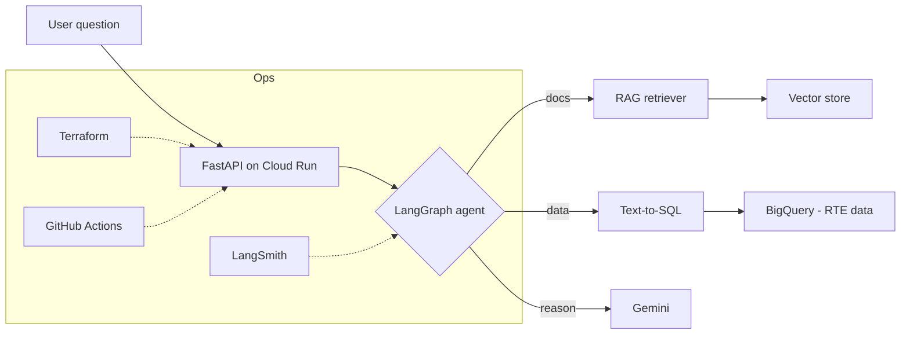

# energy-genai-assistant

Ask questions in natural language about French electricity (RTE) data and get answers backed by the **real data**. An agent decides, per question, whether to look things up in documentation (**RAG**) or to generate and run a **SQL query on BigQuery** (text-to-SQL) — then answers in plain language.

[](https://github.com/oualidall/energy-genai-assistant/actions/workflows/ci.yml)


## Why this project

Structured energy data is only useful to people who can write SQL. This project puts a **natural-language layer** on top: a business user asks a question, an agent picks the right tool, queries the data, and returns a grounded answer — deployed as a **serverless API on GCP**, provisioned entirely with **Terraform**, and monitored with **LangSmith**.

It is the LLMOps counterpart to my [rte-pipeline](https://github.com/oualidall/rte-pipeline) data-engineering project: the same RTE data, now queryable in plain French.

## Architecture



## Tech stack

| Layer | Tools |
|---|---|
| LLM / NLP | Gemini 1.5 (Google AI Studio), LangChain |
| Agent | LangGraph (routing: RAG · SQL · direct) |
| Data | BigQuery |
| API | FastAPI, Pydantic, Uvicorn |
| Infra | Terraform, Cloud Run, Artifact Registry |
| LLMOps | LangSmith (tracing + eval) |
| CI/CD | GitHub Actions, pytest, ruff |

## Quick start (local)

```bash
git clone https://github.com/oualidall/energy-genai-assistant.git
cd energy-genai-assistant
python -m venv .venv
.venv\Scripts\activate          # Windows  (Linux/macOS: source .venv/bin/activate)
pip install -r requirements.txt

cp .env.example .env            # then add your free Gemini key from aistudio.google.com/app/apikey
uvicorn src.api.main:app --reload
```

- API docs: http://localhost:8000/docs
- Health:   http://localhost:8000/healthz

## Roadmap

- [x] **Phase 0** — Repo skeleton, FastAPI contract (`/healthz`, `/ask`), CI, Dockerfile, Terraform scaffold
- [x] **Phase 1** — RTE data loaded into BigQuery + a 12-question golden eval set
- [x] **Phase 2** — RAG retriever + text-to-SQL chain with Gemini (SELECT-only guardrail)
- [x] **Phase 3** — LangGraph agent (routes RAG vs SQL vs direct) + French answer synthesis, wired into `/ask`
- [ ] **Phase 4** — Deploy to Cloud Run via Terraform + GitHub Actions CD
- [ ] **Phase 5** — LLMOps: LangSmith tracing, LLM-as-judge eval, prompt versioning

## Cost

Runs entirely within GCP free tier + free trial credit and the free tiers of Gemini API and LangSmith. Cloud Run scales to zero (no idle cost) and a Terraform-managed budget alert guards against surprises.

## License

[MIT](LICENSE)

## Author

**Oualid Allouch** — ML Engineer & MLOps practitioner
[LinkedIn](https://www.linkedin.com/in/oualid-allouch-608b3738a/) · [GitHub](https://github.com/oualidall)
