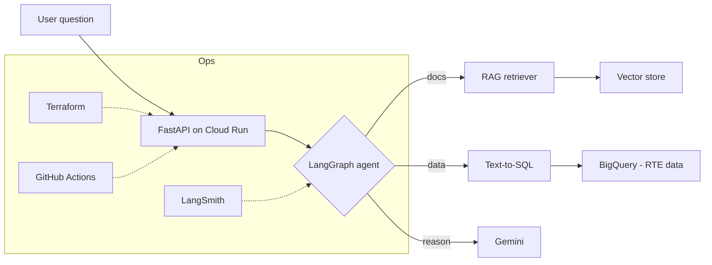

# energy-genai-assistant

A personal project that helps query French electricity data in plain French: a LangGraph router selects documentation retrieval, guarded SQL on BigQuery, or a direct answer.


GIF forthcoming; no recording has been produced yet.

## Le garde-fou en action

The table below is generated by executing the real `is_safe_sql` function.
The rule is reported by the same implementation, not inferred from expected labels.
These are lexical checks, not a SQL parser or a proof of safety for every possible query.
Use read-only BigQuery permissions as an additional boundary.

<!-- demo:guardrail:start -->
| Requête | Décision | Règle appliquée |
|---|---|---|
| <code>SELECT total_mwh FROM consommation_journaliere</code> | acceptée | SELECT/WITH prefix, no internal semicolon or forbidden keyword |
| <code>WITH totals AS (SELECT SUM(total_mwh) AS total FROM consommation_journaliere) SELECT total FROM totals</code> | acceptée | SELECT/WITH prefix, no internal semicolon or forbidden keyword |
| <code>DELETE FROM consommation_journaliere</code> | refusée | statement must start with SELECT or WITH |
| <code>DROP TABLE consommation_journaliere</code> | refusée | statement must start with SELECT or WITH |
| <code>SELECT 1; SELECT 2</code> | refusée | multiple statements (internal semicolon) |
| <code>SELECT total_mwh INTO backup FROM consommation_journaliere</code> | refusée | forbidden keyword(s): INTO |
| <code>/* harmless SELECT */ DELETE FROM consommation_journaliere</code> | refusée | statement must start with SELECT or WITH |
| <code>(chaîne vide)</code> | refusée | empty SQL |
<!-- demo:guardrail:end -->

Regenerate both this table and [docs/demo/guardrail.md](docs/demo/guardrail.md), without API calls, from the repository root:

```powershell
python -m scripts.demo_guardrail
```

CI regenerates into a temporary file and compares it with the committed artifact and this README block.

## Exemple de conversation

<!-- demo:conversation:start -->
Pending a real execution by the repository owner. No transcript or conversation results have been generated.
<!-- demo:conversation:end -->

After installing the dependencies and configuring `.env`, regenerate
`docs/demo/transcript.md` and this section with:

```powershell
python -m scripts.demo_run --run-free-tier
```

This command makes real calls: run it yourself only with a Gemini key from a project
whose paid billing is disabled. The flag is your attestation, not an API verification
of the billing tier. There is no paid fallback. Free-tier inputs and outputs may be used
to improve Google's products; see [Gemini pricing and data use](https://ai.google.dev/gemini-api/docs/pricing).
No Gemini call was made to prepare this PR.

The recorder asks the four questions defined in `scripts/demo_run.py`, runs the actual
v1 LangGraph graph and records its observed route, generated SQL (including rejected
candidates), returned rows, tool/guardrail errors, and French final answer.
It uses `gemini-2.5-flash-lite`, temperature 0, at most 1,024 output tokens per call
and a 24,000-byte prompt limit. API `usageMetadata` is saved per call;
missing usage is reported as unknown, never zero.
See the [generateContent API reference](https://ai.google.dev/api/generate-content).

A hard cap blocks the eleventh Gemini attempt, including failed attempts; there are
no automatic retries. Four questions can exceed this cap with the v1 graph.
An interrupted run exits with code 2 and keeps a clearly labelled partial transcript;
it never invents a missing answer or guardrail refusal.
A refusal routed directly by the model may have no SQL guard error: only actual events are shown.

Prerequisites: `GOOGLE_API_KEY` in `.env`, BigQuery application-default credentials
with read-only access, `GCP_PROJECT_ID` and `BIGQUERY_DATASET` pointing to existing marts.
The key alone is not enough to query BigQuery. The SQL adapter rechecks the guard before
submission and caps each query at 10,000,000 billed bytes; BigQuery billing is separate
from Gemini's free tier. Returned rows come from your configured dataset, not fixtures.
For this bounded demo, the existing retriever uses local bag-of-words embeddings over
the repository's domain notes; it does not call the default Gemini embedding service.
This retrieval configuration is recorded in the transcript and is not a benchmark of default semantic retrieval.

Windows GIF: after obtaining the transcript, record scrolling through `Get-Content -Encoding utf8 docs/demo/transcript.md` with [ScreenToGif](https://github.com/NickeManarin/ScreenToGif) and save the capture as `docs/demo/demo.gif` (no new API run).

## Architecture


```mermaid
graph LR
    U[User question] --> API[FastAPI on Cloud Run]
    API --> AG{LangGraph agent}
    AG -->|docs| RAG[RAG retriever]
    AG -->|data| SQL[Text-to-SQL]
    AG -->|reason| LLM[Gemini]
    RAG --> VS[Vector store]
    SQL --> BQ[BigQuery - RTE data]
    subgraph Ops
      TF[Terraform] -.-> API
      LS[LangSmith] -.-> AG
      GH[GitHub Actions] -.-> API
    end
```


## Local setup

Python 3.12 and the pinned dependencies in `requirements.txt`:

```powershell
python -m venv .venv
.venv\Scripts\Activate.ps1
python -m pip install -r requirements.txt
Copy-Item .env.example .env
```

Fill the configuration locally; never commit credentials. Start the API with:

```powershell
uvicorn src.api.main:app --reload
```

API documentation: http://localhost:8000/docs · Health: http://localhost:8000/healthz

## Architecture and scope notes

The diagram above retains the deployment design. The implementation includes FastAPI,
a LangGraph routing agent, Gemini, BigQuery, Docker, Terraform for Cloud Run and
Artifact Registry, budget alerts, and optional LangSmith tracing.
The retriever uses the notes in `src/rag/knowledge.py`; it is not a separate hosted vector database.
This is a personal project, not a claim of customer usage.

## Evaluation and tests

The existing golden set contains **12 questions, all SQL**, in
`src/eval/golden_questions.json`. The evaluation runner supports execution match and
an LLM judge. No evaluation score is published here without a generated result.

```powershell
python -m pytest -q
python -m ruff check src/ tests/ scripts/
```

The evaluation runner (`python -m src.eval.runner`) requires external services;
it is not needed for the offline guardrail demo or CI.
Enable `LANGCHAIN_TRACING_V2=true` and configure `LANGCHAIN_API_KEY` for LangSmith tracing.

## License

[MIT](LICENSE)

## Author

**Oualid Allouch** — personal project  
[LinkedIn](https://www.linkedin.com/in/oualid-allouch-608b3738a/) · [GitHub](https://github.com/oualidall)
