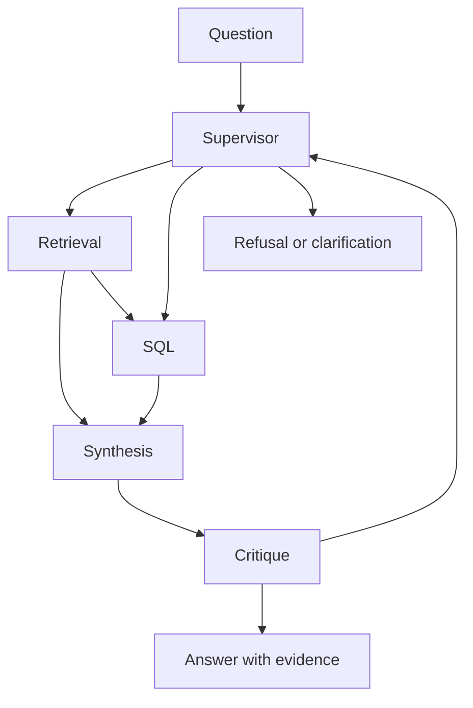

# Lot 4: bounded shared-state graph

Personal work, September 2026. This implementation is a **LangGraph shared-state graph with a supervisor and specialized agents**, not four autonomous conversational agents. Retrieval and SQL collect evidence; synthesis drafts an answer; Critique checks citations and can request replanning.



State is request-local. Evidence includes source/version, content hash, tool-call identity and optional SQL. Unknown citations, empty evidence and truncated evidence cannot produce an accepted grounded answer. The critic runs for evidence-based drafts; critic coverage and actual revision rate are separate metrics. The offline critic accepts structurally valid drafts and is **not a semantic LLM judge**.

Default ceilings: 18 node visits, 10 model calls, 6 tool calls, 2 revisions, 32,768 reserved accounting units and 2,048 output units per call. Input plus maximum output is reserved before each model call without refund. The offline adapter uses UTF-8 byte-based mock units; these are not provider tokens. Real adapters are disabled pending provider token accounting, timeouts and the dated EUR estimate. Exhaustion yields a typed terminal status.

## SQL boundary and dependency

SQL is parsed before client creation/submission. Only a single SELECT over approved tables and permitted functions is accepted; writes, multiple statements, external functions and unrelated datasets are rejected. This is a deliberately limited supported SQL subset, not a complete BigQuery validator. Read-only IAM remains necessary for a future live deployment.

[SQLGlot 25.10.0](https://pypi.org/project/sqlglot/25.10.0/) is pinned to provide AST validation beyond keyword matching. It is a Python SQL parser without additional runtime dependencies. Existing direct dependency pins remain unchanged.

The v1 graph and prompts remain available. Both variants now share the hardened execution boundary. Therefore the new v1 evaluation is **not byte-identical to the historical baseline** at 3af1e67185db5f5c172dd0cb5482f132560fda0b; manifests disclose this safety change.

## Reproduce

```bash
python -m src.eval.benchmark
python -m src.eval.compare
```

The first command recounts categories, provenance and difficulty from files. The authoritative difficulty mapping is unchanged: 15 facile, 16 moyen, 9 difficile.

The second command defaults to 40 questions x 5 repetitions x 2 variants = 400 offline attempts. A seeded question order and alternating variant order pair attempts; each variant has an isolated SQLite fixture. Raw responses, failures, integer latency samples, tool/model records, critique visits and revisions are exported. Provider tokens remain null and LLM API cost is zero for mock execution. Different mock policies prevent attributing a quality difference to orchestration alone.

**Measurement scope: synthetic SQLite snapshot, not BigQuery under real conditions.** No inference about real RTE data, Gemini reasoning, BigQuery dialect/IAM, network latency, billing or scale is supported. Full comparative results and human-validated judge scores remain later deliverables.

The existing /ask endpoint is preserved. /ask/v2 is explicitly an offline demonstration returning the typed v2 answer and metrics. MCP transport is the next minimal lot; the current tool interface is in-process.

No paid campaign may start before a dated full-campaign estimate including judging fits the total EUR 5 cap.
